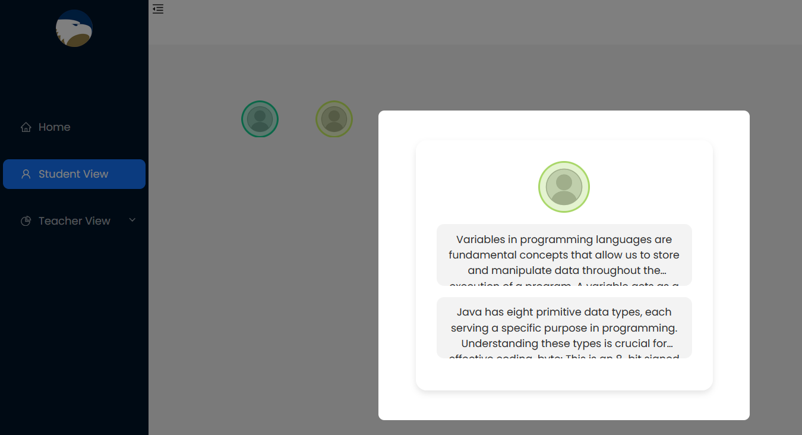
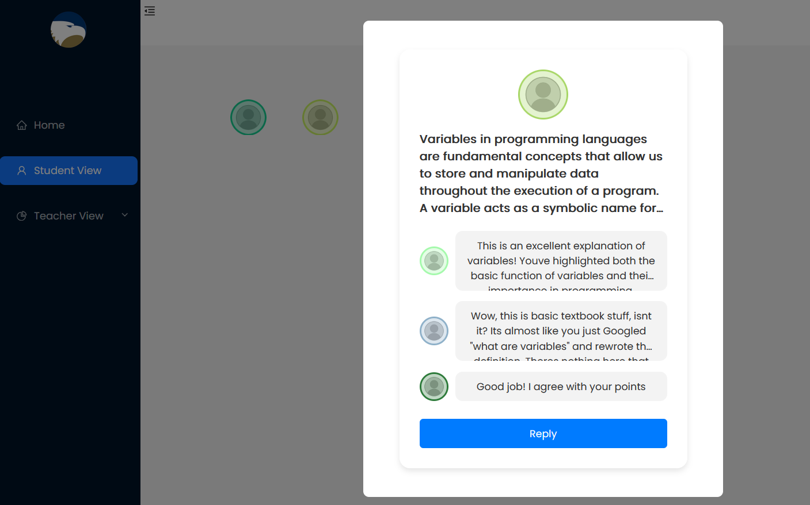
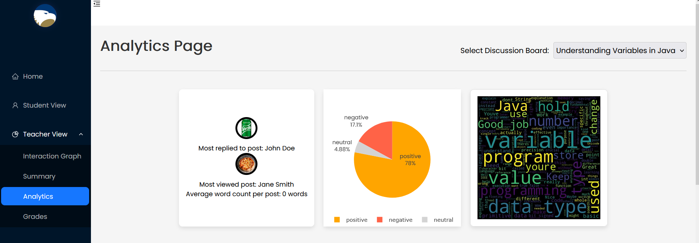
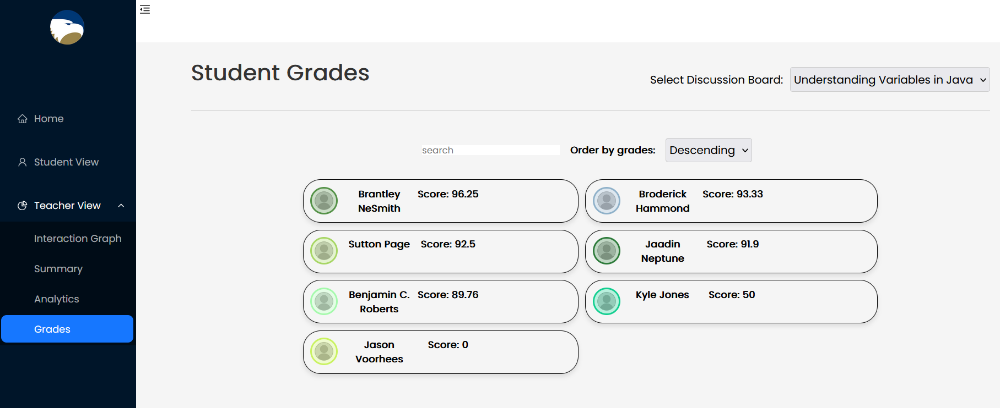

# Fall 2024 Capstone Project: Discussion Board Analytics

## Team Members
|                |                    |
|----------------|--------------------|
|Christopher Page| Benjamin C. Roberts|
|Brantley NeSmith| Broderick Hammond|
|Jaadin Neptune| |
## Overview
The goal of this capstone project was to create a website that makes it easier for college students to participate in online discussions with their classmates as part of their  course work. 

# Project Architecture

| Front End | Backend
|---------- | -------|
| React     | Java - Spring framework |
|           | Python - Flask framework|

# Screenshots

## Home Page

## Page for student to choose discussion board to view

## Graph that shows which students have replied to each others discussion posts

## UI to view and reply to other student's posts

## Analytics Pages for teachers

## Page for teachers to view student grades for discussions

